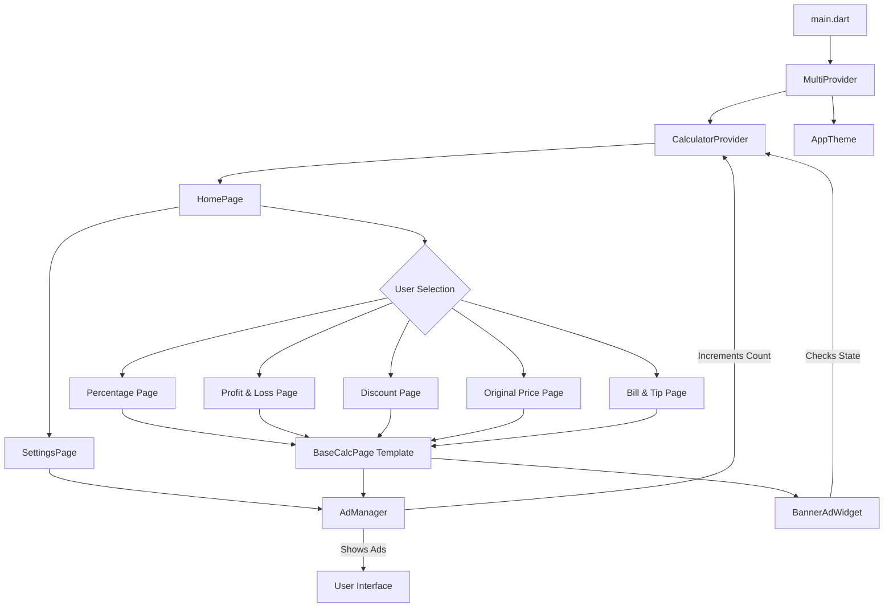
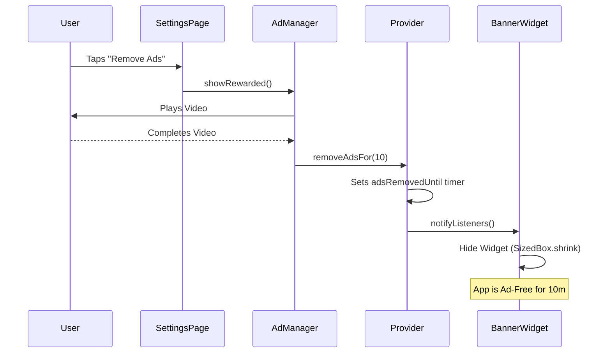

# PercentPro: Ultimate Percentage Calculator & Utility Tool

PercentPro is a high-performance, premium utility application built with Flutter. It is designed specifically for shopkeepers, students, and small business owners who need fast, accurate, and offline-first percentage calculations.

---

## 🚀 Features

PercentPro offers five specialized calculation modules, each optimized for specific real-world scenarios:

1.  **Check Percentage**: Find the exact percentage of any number (e.g., "What is 15% of 250?").
2.  **Profit & Loss**: Calculate the percentage increase or decrease between two values.
3.  **Sale & Discount**: Instantly find final prices and see total savings during shopping.
4.  **Original Price**: Reverse-calculate the original value before taxes or margins were added.
5.  **Bill & Tip**: Effortlessly split bills and calculate tips per person.

---

## 💰 Monetization & Premium Experience

PercentPro uses a balanced AdMob implementation to ensure a sustainable business model without compromising user experience:

-   **Banner Ads**: Always-visible at the bottom of the screen (Standard AdMob).
-   **Interstitial Ads**: Triggered automatically after every **3 calculations** to maintain a healthy engagement-to-add ratio.
-   **Rewarded Ads (Premium Perk)**: Users can choose to "Remove Ads for 10 Minutes" by watching a short video. This provides a completely ad-free experience (hiding all banners and stopping interstitials) for a temporary session.

---

## 🛠 Tech Stack & Architecture

-   **Framework**: Flutter (Multi-platform)
-   **State Management**: `Provider` for reactive UI updates, calculation tracking, and ad-removal sessions.
-   **Monetization**: `Google Mobile Ads` (AdMob) with centralized management.
-   **Design System**: Custom Premium Theme with `Google Fonts (Outfit)`.
-   **Navigation**: Modal-based settings and feature-driven page routing.

### System Architecture Diagram



### Ad Removal Logic Flow



---

## 📂 Project Structure

```text
lib/
├── main.dart                 # App entry point, Ad SDK init & Provider setup
├── providers/
│   └── calculator_provider.dart # Business logic, Calc tracking & Timer state
├── screens/
│   ├── home_page.dart         # Dashboard with responsive feature cards
│   ├── calculation_pages.dart # Individual feature screens & Base template
│   └── settings_page.dart      # Theme toggle & Rewarded ad removal
├── utils/
│   ├── ad_manager.dart        # Central service for Interstitial/Rewarded ads
│   └── theme.dart             # UI Tokens, Colors, and Global Styles
└── widgets/
    └── ad_widgets.dart        # Visibility-aware AdMob Banner components
```

---

## ⚖️ License & Ownership

**Copyright © 2026 Moiz Baloch. All rights reserved.**

This application and its source code are the intellectual property of **Moiz Baloch**.

### Terms of Use:
-   **Unauthorized Use**: Use, reproduction, or distribution of this code without explicit written permission is strictly prohibited.
-   **Authorized Use**: In cases where permission is granted, clear and visible credit must be given to the original author.
-   **Contact for Permissions**:
    -   **Name**: Moiz Baloch
    -   **Email**: khanmoaiz682@gmail.com
    -   **Phone**: +92 306 7892235

---

## 👨‍💻 Development Guidelines

1.  **Ad Logic**: Never trigger ads manually in UI files. Use `AdManager.showInterstitialIfNeeded(provider)` to ensure the 3-calc threshold and ad-removal timers are respected.
2.  **Debug Mode**: The `AdManager` uses the User's Test IDs automatically in debug builds (via `kDebugMode`). Do not manually swap Unit IDs in production code.
3.  **Responsiveness**: The app uses a threshold of `600px` to distinguish between Mobile and Tablet layouts. Always test UI changes on both form factors.

---
*Built with ❤️ by Moiz Baloch*
