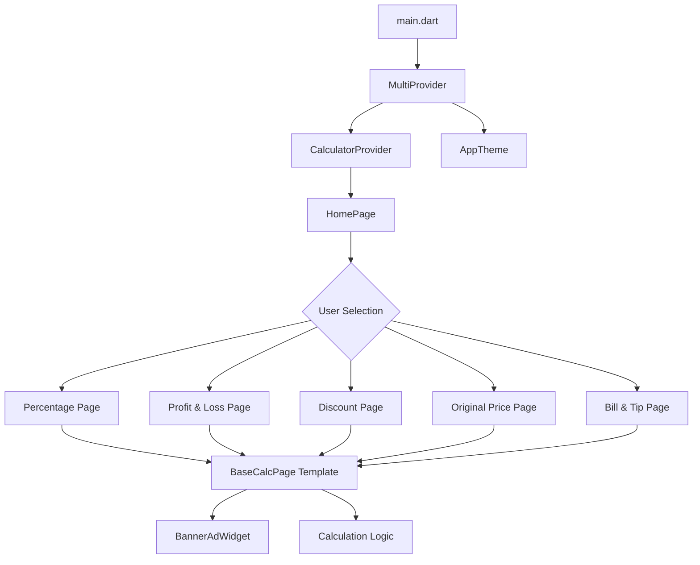
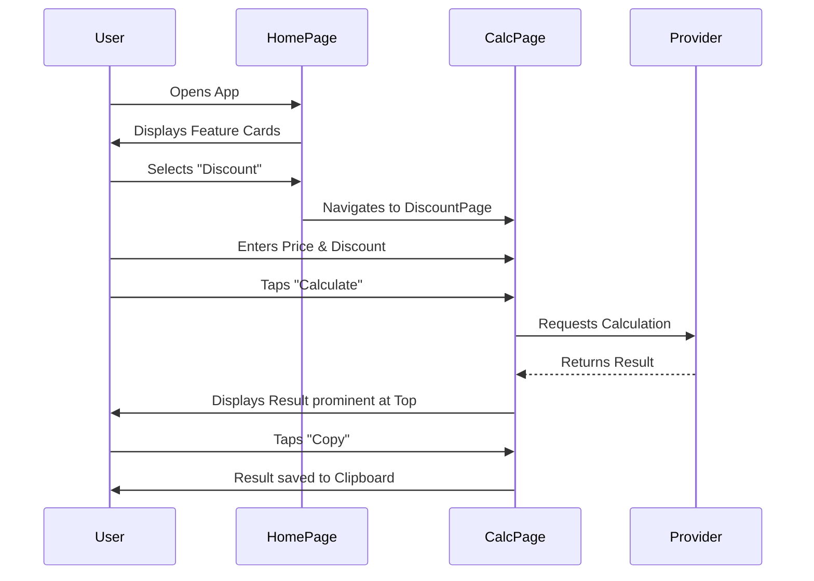

# PercentPro: Ultimate Percentage Calculator & Utility Tool

PercentPro is a high-performance, premium utility application built with Flutter. It is designed specifically for shopkeepers, students, and small business owners who need fast, accurate, and offline-first percentage calculations.

---

## 🚀 Features

PercentPro offers five specialized calculation modules, each optimized for specific real-world scenarios:

1.  **Check Percentage**: Find the exact percentage of any number (e.g., "What is 15% of 250?").
2.  **Profit & Loss**: Calculate the percentage increase or decrease between two values.
3.  **Sale & Discount**: Instantly find final prices and see total savings during shopping.
4.  **Original Price**: Reverse-calculate the original value before taxes or margins were added.
5.  **Bill & Tip**: Effortlessly split bills and calculate tips per person.

---

## 🛠 Tech Stack & Architecture

-   **Framework**: Flutter (Multi-platform)
-   **State Management**: `Provider` for reactive UI updates and clean separation of logic.
-   **Monetization**: `Google Mobile Ads` (AdMob) integrated with smart layout safety.
-   **Design System**: Custom Premium Theme with `Google Fonts (Outfit)`.
-   **Layout**: Fully responsive `MediaQuery` based design for Mobile and Tablets.

### System Architecture Diagram



### Application Flow



---

## 📂 Project Structure

```text
lib/
├── main.dart                 # App entry point & Provider setup
├── providers/
│   └── calculator_provider.dart # Business logic & Calculation engine
├── screens/
│   ├── home_page.dart         # Main dashboard with feature cards
│   └── calculation_pages.dart # Individual feature screens & Base template
├── utils/
│   └── theme.dart             # UI Tokens, Colors, and Global Styles
└── widgets/
    └── ad_widgets.dart        # Reusable AdMob Banner components
```

---

## ⚖️ License & Ownership

**Copyright © 2026 Moiz Baloch. All rights reserved.**

This application and its source code are the intellectual property of **Moiz Baloch**.

### Terms of Use:
-   **Unauthorized Use**: Use, reproduction, or distribution of this code without explicit written permission is strictly prohibited.
-   **Authorized Use**: In cases where permission is granted, clear and visible credit must be given to the original author.
-   **Contact for Permissions**:
    -   **Name**: Moiz Baloch
    -   **Email**: khanmoaiz682@gmail.com
    -   **Phone**: +92 306 7892235

---

## 👨‍💻 Development Guidelines for Future Contributors

1.  **State Management**: Always use the `CalculatorProvider` for business logic. Do not put calculation math inside UI widgets.
2.  **Theming**: Reference `AppTheme` for colors. Avoid hardcoding hex values in the UI layer.
3.  **Responsiveness**: Use `MediaQuery` variables (e.g., `isTablet`) to adjust layouts for different screen factors.
4.  **Ad Safety**: All new pages must wrap the banner area in a `SafeArea` with a bottom margin of at least `10.0` to avoid system navigation overlap.

---
*Built with ❤️ by Moiz Baloch*
